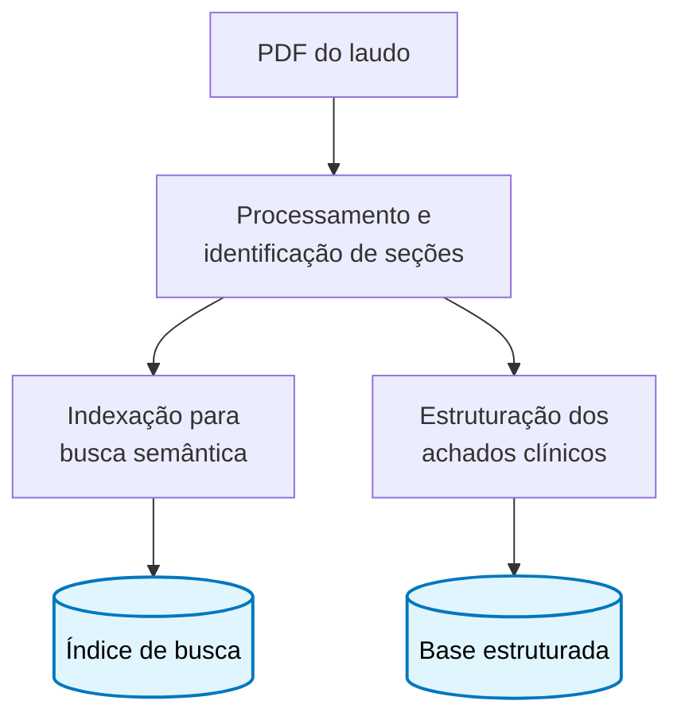
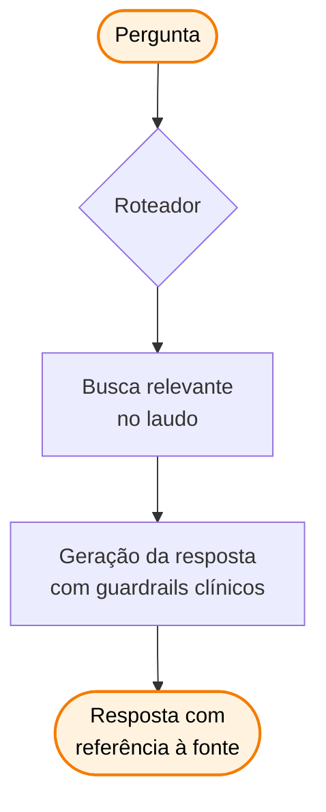

# Decifra

Proposta conceitual de camada de IA para acessibilidade de relatórios genéticos da Genera (DASA).

> Enterprise Challenge DASA · FIAP · IA · Fase 3 · Sprint 1

> ⚠️ **Aviso de propriedade intelectual.** Esta entrega contém material de natureza acadêmica, registrada em repositório com data e autoria. Ver seção [Propriedade intelectual](#propriedade-intelectual) ao final.

---

## Sumário

1. [O problema](#o-problema)
2. [A solução em alto nível](#a-solução-em-alto-nível)
3. [Quem usa](#quem-usa)
4. [Visão geral da arquitetura](#visão-geral-da-arquitetura)
5. [Governança e compliance](#governança-e-compliance)
6. [Roadmap](#roadmap)
7. [Propriedade intelectual](#propriedade-intelectual)
8. [Repositório](#repositório)

---

## O problema

A Genera entrega informação genética de alto valor em **PDFs longos com linguagem técnica densa**.

Resultado prático:

- O paciente recebe e não consegue usar para decisão.
- O clínico gasta tempo em parsing manual.
- A informação fica congelada no documento.

A dor não é de exame, é de **interface** com o conhecimento gerado pelo exame.

---

## A solução em alto nível

Decifra é uma camada conversacional sobre o relatório individual. Três blocos:

| Bloco | Função |
|---|---|
| **Ingestão** | Laudo é processado e indexado para consulta |
| **Conversa** | Usuário pergunta em linguagem natural, recebe resposta com referência |
| **Dashboard** | Achados organizados por categoria clínica |

### Princípio de produto

> A IA aqui **não substitui o médico**. Ela apoia o entendimento e encaminha para o profissional adequado.

### Modos de voz

A interface oferece tom adaptado ao perfil de quem consulta (paciente em linguagem acessível, clínico com terminologia técnica).

---

## Quem usa

### Paciente

- **Contexto:** acabou de receber o laudo
- **Casos de uso:** entender o próprio risco, saber se familiares devem testar, decidir quando procurar especialista
- **Limite:** nunca recebe diagnóstico ou prescrição

### Clínico

- **Contexto:** está atendendo o paciente, com pouco tempo
- **Casos de uso:** identificar achados acionáveis, comparar com guidelines

### Time interno DASA / Genera

- **Contexto:** monitora o produto e identifica gaps no laudo atual
- **Casos de uso:** dashboards agregados de uso e feedback

---

## Visão geral da arquitetura

A solução é dividida em **dois fluxos** com responsabilidades claras.

### Fluxo 1 · Ingestão

> Roda uma vez por laudo, assíncrona.

### Fluxo 2 · Consulta

> Roda toda vez que o usuário pergunta, síncrono.

### Princípios da arquitetura

| Princípio | Como se manifesta |
|---|---|
| Rastreabilidade | Toda resposta cita a página do laudo de onde veio |
| Defesa em camadas | Validação na entrada e na saída |
| Auditabilidade | Toda consulta é registrada para revisão posterior |
| Reversibilidade | Pipeline de esquecimento permite remoção completa de dados de um paciente |

---

## Governança e compliance

### Categoria do dado

Genética é **categoria especial pela LGPD**. Adiciona requisitos sobre:

- Coleta com finalidade específica
- Armazenamento por tempo limitado
- Direito ao esquecimento
- Consentimento explícito e revogável

### Controles propostos

| Controle | Descrição |
|---|---|
| Identificação do paciente | Anonimização em logs e traces |
| Encryption at rest | Padrão de mercado em todos os armazenamentos |
| Encryption in transit | TLS em todas as comunicações |
| Auditoria | Registro completo de inferência com retenção apropriada |
| Direito ao esquecimento | Pipeline de remoção em cascata |
| Data residency | Cloud em região brasileira |
| Treino com dado real | Não autorizado. Treino apenas com dado sintético. |

### Guardrails da resposta

A resposta da IA respeita regras clínicas não-negociáveis:

- Nunca diagnostica
- Nunca prescreve medicamento
- Nunca afirma prognóstico
- Sempre cita a fonte do laudo
- Sempre marca incerteza quando a evidência é fraca
- Sempre encaminha ao clínico em caso acionável

---

## Roadmap

### Sprint 1 (atual)

- ✅ Proposta documentada
- ✅ Arquitetura conceitual definida
- ✅ Governança especificada

### Sprint 2

- Protótipo funcional sobre laudo sintético
- Backend e frontend mínimos integrados
- Pipeline de avaliação inicial

### Sprint 3

- Modos paciente e clínico separados
- Dashboard de findings
- Vídeo demo end-to-end
- Métricas de avaliação consolidadas

### Pós-Challenge

A evolução posterior depende de acordo formal com DASA, aprovação ética e validação clínica.

---

## Sobre dado real

Esta proposta utiliza exclusivamente **dado sintético**. Implementação com laudo de paciente real exige:

1. Acordo formal com DASA e Genera
2. Aprovação ética via CEP/CONEP
3. Validação clínica com especialistas

Não é restrição arbitrária. É a única forma compatível com LGPD categoria especial e Resolução CFM.

---

## Propriedade intelectual

> ⚠️ **Importante.**

Esta proposta é trabalho acadêmico autoral, registrado em repositório privado com data e autoria identificadas. A submissão à FIAP no contexto do Enterprise Challenge tem **finalidade exclusivamente avaliativa**.

**Não constitui:**

- Transferência de propriedade intelectual
- Licença de uso comercial
- Autorização de implementação por terceiros
- Cessão de direitos sobre arquitetura, decisões técnicas ou metodologia descritas

**Implementação ou incorporação parcial ou integral em produto comercial requer acordo formal específico com o autor**, conforme orientação acadêmica da própria FIAP no enunciado do Challenge:

> *"A FIAP recomenda que, se o grupo pretende ir para além dessa simulação de atendimento de clientes reais por meio do programa Challenge Sprint, a ideia seja mantida em sigilo e não seja aplicada nas entregas desse enunciado."*

O autor reserva o direito de desenvolver, comercializar ou licenciar esta solução de forma independente.

---

## Autor

**Luiz Felipe Alves Gomes** · RM 565151 · Turma A
