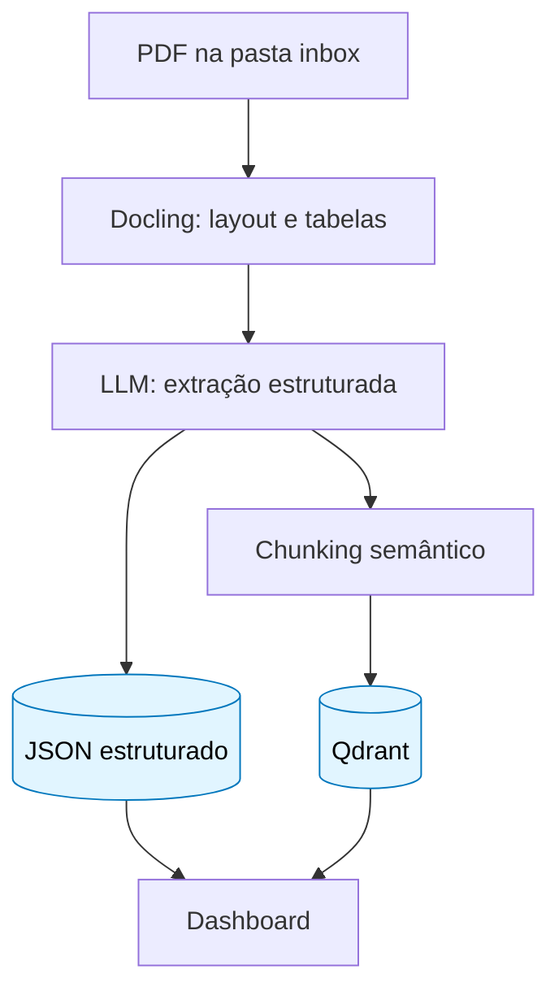
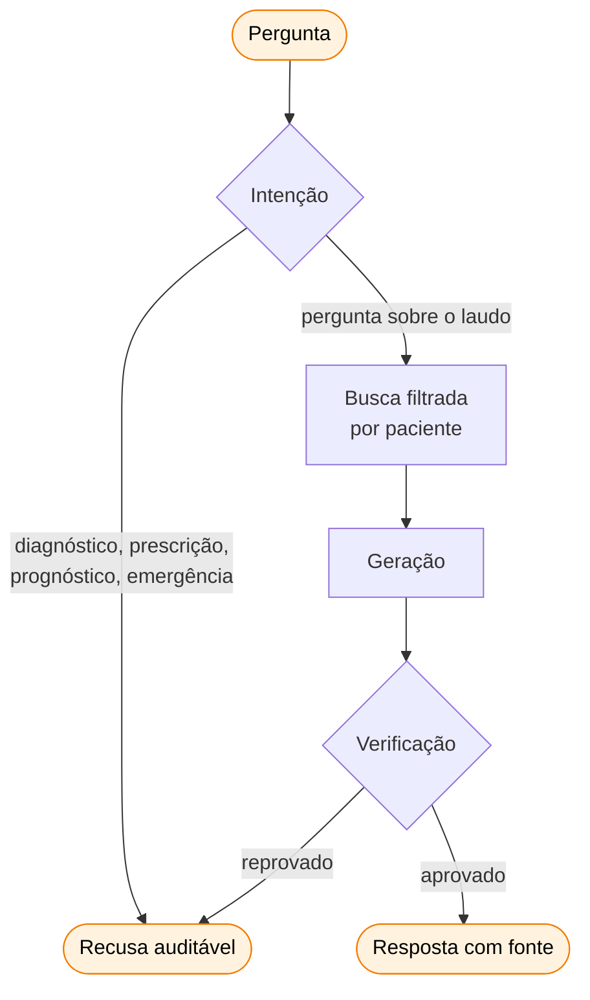

# Arquitetura de IA

Como o laudo vira dado consultável, como o agente responde, e por que cada peça é a que é.

## Visão geral

Dois fluxos com responsabilidades separadas.





## Ingestão

### Por que Docling e não um extrator de texto

O laudo genético é majoritariamente tabela, e nela **a coluna a que um valor pertence é o significado dele**. Um extrator linear devolve:

```
Campo Valor Gene F5 Variante rs6025 (Fator V de Leiden) Genotipo Heterozigoto (G/A)
Classificacao de risco Aumentado Risco relativo Cerca de 3x
```

e transfere ao modelo a tarefa de adivinhar qual valor pertence a qual campo. O TableFormer do Docling preserva a grade e entrega uma tabela markdown de verdade. Foram detectadas 8 tabelas por laudo.

Ganho secundário e decisivo: **a paginação vem do Docling**, via `export_to_markdown(page_no=N)`. Antes, o número da página dependia do modelo ler corretamente um marcador, o que é frágil justamente no campo que existe para dar rastreabilidade. Agora é transcrito, não inferido.

O `torch` está fixado na build **CPU-only** via `tool.uv.sources`. Sem o pin, o Docling puxa wheels CUDA e o ambiente vai de 1,7 GB para 5,5 GB numa máquina sem GPU.

### Por que extração por LLM e não regex

Nós controlamos o layout dos laudos sintéticos, então regex funcionaria aqui e quebraria no primeiro laudo real da Genera, cujo layout ninguém controla. O `structured_output` sobre um schema Pydantic mantém o contrato nos dois casos.

A extração roda com `reasoning_effort="high"`: é uma passada única sobre o documento inteiro, e um genótipo mal transcrito contamina toda resposta futura.

### Chunking semântico, não por tamanho

Um splitter de tamanho fixo cortaria um achado ao meio e permitiria à busca devolver um genótipo sem a interpretação, ou um risco relativo sem a frase que diz que a maioria dos portadores nunca desenvolve a condição. **Nesse domínio, é esse truncamento que faz estrago.**

Cada achado vira exatamente um documento, com `patient_id`, seção, título, gene, nível de risco e página no payload.

### Indexação automatizada

`scripts/ingest.py` implementa o padrão de hot folder: PDF em `inbox/` é processado e movido para `processed/`. O movimento é o que garante idempotência. Checar "já existe JSON para este arquivo" não funciona, porque o JSON é nomeado pelo `patient_id` extraído de dentro do documento, não pelo arquivo, e o mesmo laudo sob outro nome reingeriria para sempre.

`--watch` faz polling a cada 5 segundos. Uma biblioteca de eventos de sistema de arquivos adicionaria dependência para economizar segundos num pipeline cujo passo mais lento leva um minuto.

## Recuperação

Busca semântica sobre `text-embedding-3-small` (1536 dimensões, cosine), **sempre filtrada por `patient_id`**.

O filtro não é opcional nem decidido pelo modelo: `RetrievalMiddleware` roda no `before_model` e o paciente vem do contexto do chamador. Retrieval **não** é exposto como tool justamente por isso: tool deixa o modelo decidir se vai olhar o laudo, e responder sobre o genoma de alguém sem ler o laudo é a única coisa que este sistema não pode fazer.

Isolamento verificado: cinco consultas cruzadas buscando, no contexto de um paciente, termos que só existem no laudo do outro. Nenhum vazamento.

## Escolha de modelo

Os `gpt-5.6` são tiers, não variantes:

| Modelo | Posição | Preço /1M |
|---|---|---|
| Sol | Flagship | $5 / $30 |
| **Terra** | Equilibrado, iguala o 5.5 por metade do custo | $2 / $12 |
| **Luna** | Latência e volume | $0,20 / $1,20 |

Usamos dois, por papel:

- **Terra** para a resposta fundamentada, onde precisão importa
- **Luna** para classificação de intenção, verificação, simplificação e resumo, que são alto volume e raciocínio raso

Sol seria pagar 15x o Luna para tarefas que não pedem flagship.

`reasoning_effort` é calibrado por papel, seguindo a orientação da OpenAI de tratar effort como último ajuste e acertar a instrução primeiro: `high` na extração, `medium` na geração, `low` em classificação e reescrita.

## Engenharia de prompts

- Instruções vão em mensagem **`developer`**, que tem prioridade sobre `user` na hierarquia da OpenAI
- Prompts vivem versionados em código (`features/*/content.py`), não em objetos remotos
- A classificação de intenção usa **exemplos discriminativos**. Sem eles, "o que meu relatório diz sobre Alzheimer?" era classificado como pedido de diagnóstico e recusado. Com eles, 12/12 casos corretos
- O texto em português fica isolado nos arquivos de conteúdo; código e chaves em inglês

## Streaming com verificação por parágrafo

Transmitir token a token colocaria texto **não verificado** sobre a saúde de alguém na tela. Mostrar uma afirmação diagnóstica por três segundos e retirá-la é pior que fazer a pessoa esperar.

O SSE libera **um parágrafo verificado por vez**: os tokens acumulam num buffer e, quando o parágrafo fecha, passa pelo mesmo verificador do middleware. A latência percebida cai de "nada por trinta segundos" para "primeiro parágrafo em cerca de cinco", sem nunca exibir texto não conferido.

Os eventos de etapa vêm dos updates do próprio grafo, então a linha de progresso descreve o que está acontecendo. Ela é ordenada e nunca retrocede: os updates chegam em lote e um progresso que anda para trás lê como defeito.

## Resumos automáticos

Duas superfícies, o mesmo tratamento.

O **resumo do relatório** é gerado a partir dos achados estruturados, ordenados por relevância clínica, e reflete automaticamente qualquer laudo novo ingerido para o paciente. O **resumo da conversa** é regenerado a partir dos turnos guardados no checkpointer.

Ambos passam pelo verificador de fronteira clínica antes de chegar à tela, com a mesma política de fail-closed do chat: são superfícies onde o modelo escreve sobre a saúde de alguém, e confiar só no prompt delas seria abrir pela lateral o buraco que o chat fechou.

O prompt do resumo do relatório precisou de uma instrução explícita para nunca afirmar que a pessoa "tem" uma condição, mesmo quando o laudo classifica o resultado como compatível com ela.

## Memória

O checkpointer do LangGraph sobre Postgres. Uma thread por sessão, com o `patient_id` compondo o `thread_id`, de modo que o isolamento do retrieval se reflete na memória e um paciente pode ter mais de uma conversa em vez de uma única eterna.

Cuidado que custou um bug: middlewares que devolvem `messages` **acrescentam** em vez de substituir, a menos que reusem o `id` da mensagem original. Sem isso, o texto bloqueado ficava no histórico ao lado do que o substituiu.
