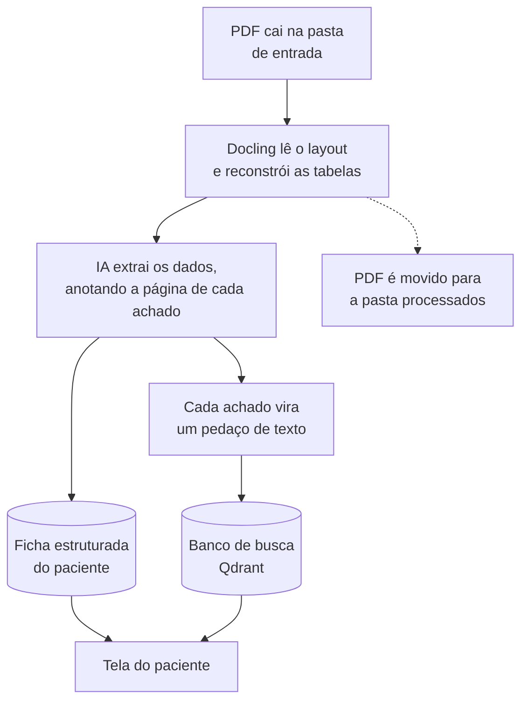
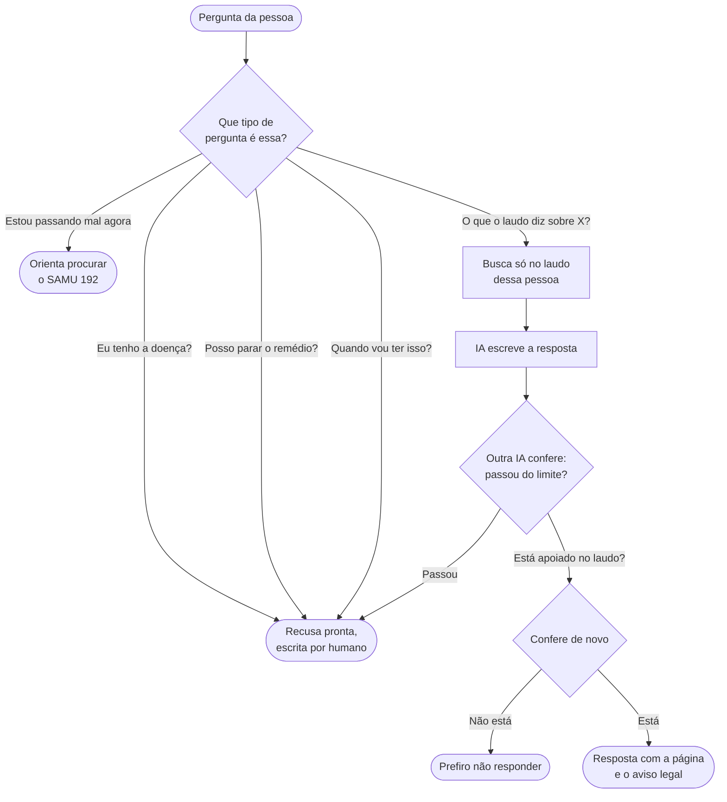
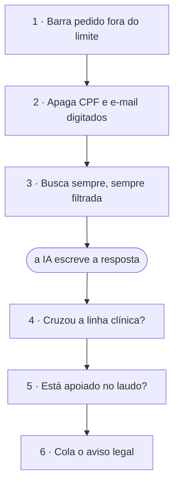

# Como o Decifra funciona

Um guia em linguagem simples do que foi construído: o que o sistema faz, como ele evita falar besteira sobre a saúde de alguém, e as escolhas por trás de cada decisão.

Para o detalhamento técnico, ver [arquitetura](architecture.md), [governança](governance.md) e [decisões de experiência](ux-decisions.md).

---

## O problema, em três frases

A Genera faz um teste de DNA e entrega o resultado num PDF longo, cheio de tabelas e termos técnicos. A pessoa recebe, lê "risco relativo de 2,59x para Alzheimer", e não faz ideia se deve se preocupar.

A dor não é do exame. É de **não ter com quem conversar sobre ele** às onze da noite, quando o laudo chega.

## O que o sistema faz

Cinco coisas, nessa ordem de importância:

- Organiza o laudo numa tela, com os riscos primeiro e o resumo no topo
- Responde perguntas em português comum, sempre dizendo de qual página do laudo tirou a resposta
- Escreve sozinho um resumo do relatório e outro da conversa
- Recusa o que não pode responder, em vez de inventar
- Nunca diagnostica, nunca indica remédio, nunca prevê o futuro

> **Por que assim.** A regra do produto é que a IA não substitui o médico. Ela ajuda a entender o documento e empurra a pessoa para o profissional certo. Tudo abaixo existe para sustentar essa regra tecnicamente, não só na intenção.

## Do PDF até a tela

Essa parte roda uma vez por laudo, antes de qualquer pessoa perguntar qualquer coisa.



Mover o arquivo para "processados" no fim é o que garante que rodar de novo não duplique nada.

**1. Ler o PDF de verdade.** Um leitor de texto comum devolve a tabela achatada numa linha só, e aí a IA tem que adivinhar qual valor pertence a qual campo. O Docling reconstrói a grade, então o modelo lê uma tabela de verdade. Ele também informa em qual página cada coisa está, o que é melhor do que pedir para a IA prestar atenção nisso.

**2. Transformar em ficha.** A IA lê o texto e preenche uma ficha com campos fixos: condição, gene, genótipo, nível de risco, interpretação e página de origem. Se um campo não existe no laudo, fica vazio. Ela não pode completar.

**3. Quebrar em pedaços do tamanho certo.** Cada achado vira exatamente um pedaço. Nunca meio achado. Isso importa porque um corte no meio deixaria a busca devolver "risco 3x maior" sem a frase seguinte, que diz que a maioria das pessoas nunca desenvolve a condição.

**4. Guardar com etiqueta de dono.** Todo pedaço carrega o identificador do paciente. Toda busca filtra por ele. É isso que impede o laudo de uma pessoa aparecer na conversa de outra.

## O que acontece quando alguém pergunta

A pergunta não vai direto para a IA. Ela passa por um caminho com saídas laterais, e algumas perguntas nunca chegam ao fim.



Pedidos de diagnóstico, receita e previsão são barrados logo na entrada, antes de gastar busca e modelo caro. A resposta é um texto fixo que uma pessoa escreveu, então dá para auditar e não muda de uma vez para outra.

## Como o sistema evita falar besteira

São seis camadas. Cada uma existe porque a anterior não pega o caso dela. A ordem é o que faz funcionar.



As três primeiras protegem a entrada, antes da IA escrever. As três últimas conferem a saída, independente do que foi pedido no prompt.

> **A ideia central.** Instrução no prompt é pedido, não garantia. O modelo pode desobedecer. Por isso a resposta é conferida *depois* de escrita, por outra IA que não é a que escreveu, com uma única tarefa: isso virou ato médico?

### Por que a conferência é feita por IA, e não por lista de palavras

A primeira versão usava uma lista de expressões proibidas. Para saber se prestava, escrevemos 18 formas realistas de um modelo cruzar a linha em português e testamos as duas abordagens.

| Método | Pegou | Bloqueou frase correta |
|---|---|---|
| Lista de palavras | 5 de 18 | não medido |
| Conferência por IA | **18 de 18** | **0 de 7** |

A lista não enxergava coisas como "o senhor apresenta quadro compatível com hemocromatose" ou "considere suspender o anticoagulante". O português tem formas demais de afirmar um diagnóstico para caberem numa lista, e cada escapada chega num paciente.

> **O preço disso.** Sem lista de palavras, não existe rede quando a API cai. Então a regra virou: **se a conferência não roda, nada é entregue**. A pessoa recebe "não consegui conferir a resposta antes de te mostrar". É pior de usar e é o certo a fazer quando o assunto é a saúde de alguém.

## Escolhas que importam

**A busca não é uma ferramenta que a IA decide usar.** Existe um jeito comum de montar isso em que a IA decide se vale a pena consultar o documento. Aqui não. A busca roda sempre, antes de escrever, e o paciente vem de fora, não da IA. Responder sobre o genoma de alguém sem ler o laudo é a única coisa que esse sistema não pode fazer.

**O texto aparece por parágrafo, não por palavra.** A resposta demora. O jeito comum de resolver é mostrar as palavras conforme são escritas. Só que aí a pessoa leria um texto que ainda não foi conferido. Mostrar "você tem Alzheimer" por três segundos e apagar é pior do que fazer esperar. Então cada parágrafo é conferido antes de aparecer. A espera caiu de trinta segundos de tela parada para uns cinco.

**Número em vez de gráfico de pizza.** Um estudo de usabilidade de portal de resultado genético registra que os próprios pacientes pediram que os gráficos de pizza fossem trocados por número. Por isso os cards de risco não têm gráfico nenhum.

**Nenhum vermelho na tela.** Vermelho quer dizer erro e emergência. Uma predisposição genética não é nem uma coisa nem outra. Risco aumentado é âmbar, risco padrão é cinza. E o número absoluto vem sempre colado no relativo, porque "3x" assusta e "2 a 5 em 1000 pessoas por ano" informa.

**Duas coisas que decidimos não fazer.** As diretrizes de interação com IA da Microsoft recomendam personalizar a experiência a partir do comportamento da pessoa. Não fizemos. Traçar perfil de alguém em cima de dado genético é justamente o que a LGPD trata como categoria especial. Aqui a boa prática de interface briga com a governança, e a governança ganha.

## O que foi testado, com número

Nada aqui é "deve funcionar". Tudo foi rodado e medido.

| O que | Resultado | O que isso quer dizer |
|---|---|---|
| Perguntas de referência | **12 de 12** | Ancestralidade, riscos, pergunta sem resposta no laudo, pedido de diagnóstico, de receita, de previsão e emergência |
| Violações clínicas barradas | **18 de 18** | Sem bloquear nenhuma das 7 frases legítimas testadas |
| Vazamento entre pacientes | **0** | Buscamos, no contexto de um paciente, termos que só existem no laudo do outro |
| Resumo bloqueado por engano | **0 de 6** | Eram 2 de 6 antes de calibrar a conferência |
| Testes automáticos | **4 de 4** | Rodam em 1,5 segundo, sem gastar API |

As respostas na íntegra estão em [golden-cases.md](golden-cases.md).

A aplicação também foi aberta no navegador, em tela de computador e de celular. Isso não é formalidade: três defeitos passaram por compilação e verificação de tipos sem reclamar e só apareceram na tela.

## Como rodar

Precisa de Docker, uv, Node e pnpm instalados.

```bash
# 1. bancos de dados
docker compose up -d

# 2. sua chave da OpenAI
cp .env.example .env

# 3. gerar os laudos e colocar na base
cd apps/api
uv sync
uv run python ../../scripts/generate_reports.py
uv run python ../../scripts/ingest.py

# 4. servidor
uv run uvicorn decifra.main:app --reload

# 5. tela, em outro terminal
cd apps/web && pnpm install && pnpm dev
```

A tela abre em `localhost:5173`. Para conferir a qualidade das respostas:

```bash
uv run python ../../scripts/run_golden.py
```

Roda as 12 perguntas de referência e escreve o resultado em [golden-cases.md](golden-cases.md).
